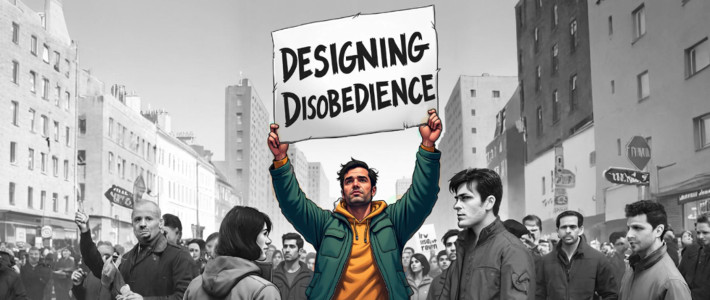

## Cyclone Daniel: Flooded Realities

In September 2023, Cyclone Daniel devastated Greece and Libya, exposing the fragility of human systems and amplifying global crises like climate change and inequality. While the storm's destruction was widely covered, the focus was uneven: Greece, a European Union member, received more attention, while Libya, struggling with political instability, was largely ignored. Social media further reduced the event to viral moments, sidelining the human cost in favor of shock value.

We therefore took a multi-dimensional critical approach of exploring the incident combining stories on the ground with meteorological research and data and investigation into the marks on social media platforms. 

Our project aims to slow the rush of sensationalism, creating a space where the storm’s deeper implications can be explored. Through art, we blend visuals, sounds, and objects to tell stories often overlooked. Satellite images of flooded cities are paired with personal artifacts, while voices of survivors share their memories of loss and resilience. Data on climate change and infrastructure failures highlight the unequal impact of the storm.

This project invites reflection on how crises are shaped by power, media systems, and geopolitical structures. It asks: who gets to be seen, and who is left in the margins? Ultimately, we seek to challenge how we consume news and engage with global stories, inspiring reflection and action toward a more just future.

### Scraping tweets from X given specific search parameter
Simple function using selenium , personal X credentials for collecting tweets quickly

### Why this project was created 
This project was created as part of the Designing Disobedience call in Neme Gallery. 
https://www.neme.org/projects/designing-disobedience  

### Creators/collaborators 
- Constantinos Constantinou 
- Vasilis Vasiliou
- Giannis Floulis 
- Louiza Vradi

### Repo owner contact   
- basibluepill@googlemail.com

### About this repo 
This repository is for the data analysis part of the project.
Feel free to clone and adapt for your own purposes. 

### Setup prerequis ites:
- install pip : https://pip.pypa.io/en/stable/installation/
- install pipenv : https://pipenv.pypa.io/en/latest/installation.html

### Gather tweets:
- in a terminal in the project directory run the following : 
- pipenv install 
- create a .env file. Sample: 
  - X_email = 
  - X_pass = 
- run the data_gather.py file or work in the interactive jupyter notebook environment